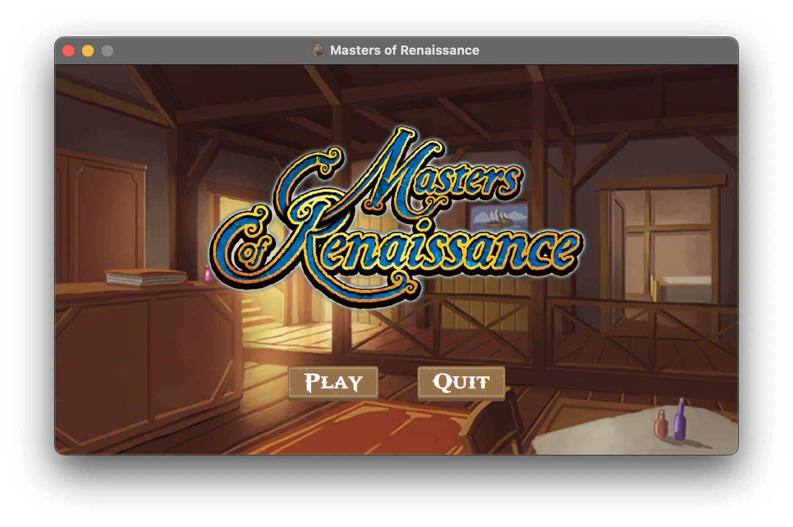
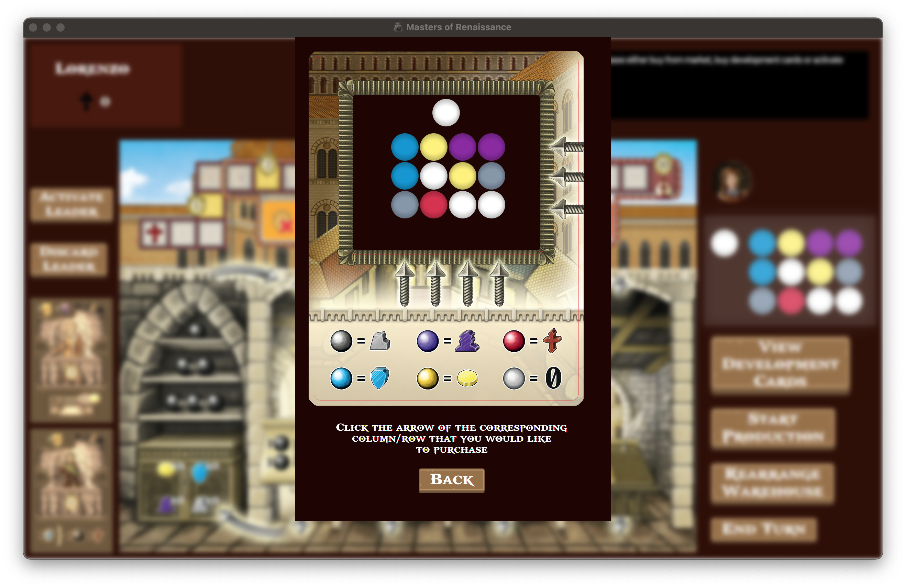
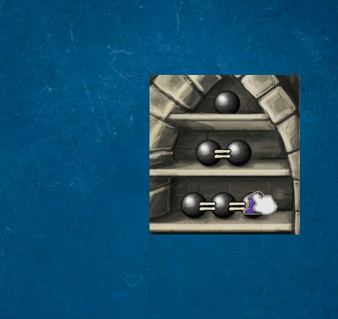

# Masters of Renaissance Board Game

This project is the digitalised version of "*Masters of Renaissance*" board game. It has been developed as final test of Software Engineering, course of Computer Science Engineering at Politecnico di Milano during the 2020/21 A.Y.

## Game
The original board game is by *[Cranio Creations s.r.l.](https://www.craniocreations.it/prodotto/masters-of-renaissance/)* and allows at maximum 4 players to play together. 

The digital version here aims to mimic the original one adding those extra comforts given by online gaming.





## Devs 
AM13 team members: 
[Javin Barone](https://github.com/Javinyx), [Ottavia Belotti](https://github.com/OttaviaBelotti), [Alessio Braccini](https://github.com/AlessioBraccini)
<br/>
Professor Supervisor: Alessandro Margara

## Advanced Features

| Feature       | Status        |
|---------------|:---------------:|
|Basic Rules| Done|
|Full Rules | Done|
|Command Line Interface| Done |
|Graphical User Interface| Done|
|Local Game     | Done|
|Multiple Games | Done|



## JAR usage
The game is splitted into two JAR files, both can be downloaded form [Deliverables directory](https://github.com/Javinyx/ingswAM2021-Barone-Belotti-Braccini/tree/main/deliverables/jar).
<br>Unless it is desired to play a local game, one Server app instance must be running before the client can actually start playing.</br>

Both server and client app can run on Unix systems (Linux, macOS) or Windows system (on Powershell, cmd and WSL).

### Server app
Run from console the `MasterOfRenaissanceServer.jar` file using the command:
```
java -jar MasterOfRenaissanceServer.jar
```
By default, if no extra argument is added in the command above, the server will listen for incoming connection on port **27001**. Otherwise, the user can choose the custom port on console:
```
java -jar MasterOfRenaissanceServer.jar 2500
```
### Client app
To start the client app, either click on the `MasterOfRenaissance.jar` file (GUI mode only) or use the console for more options:
* GUI mode: `java -jar MasterOfRenaissance.jar`
* CLI mode: `java -jar MasterOfRenaissance.jar cli`
* CLI mode local game: `java -jar MasterOfRenaissance.jar cli local`

## Game Initialization
Once the client app is running and the connection with the server is established, both CLI and GUI mode will ask the player for the in-game nickname and game size wished. The nickname must be unique within the lobby in which the player is put, but multiple players can share the same nickname if they're in different lobbies.
<br>

Players will be kept waiting until the lobby reaches the capacity asked upon starting the session. Once the server has gathered as many players as necessary, it starts the initialization phase: all players have to choose 2 *Leader Cards* among a set of four chosen randomly by the server for each of them. Furthermore, some players have the right to own "starting resources" and *Faith Points* based on their turn, so if the players are eligible, they should choose as many initial resources as stated by the server.
<br>

Once every player has ended the initial phase, the actual game can finally start. The server communicate who has to start, while the others will wait for their turn.

## Mid-game Phase
Once it's the player turn, different actions can be done (some just once every turn):
1. Buy resources from the shared market
2.  Buy a *Development Card* from the ones available at that moment
3. Activate one or more *Production Power* given by the player's *Development Cards* owned
4. Activate a *Leader Card*
5. Discard a *Leader Card* still inactive
6. Use an active *Leader Card*'s power
7. View opponents status
8. View still available Development Cards

Actions 1 through 3 can be executed just once every turn and in mutual exclusion. Leader powers can be used at maximum twice each turn.
<br>

For more detailed rules, please refer to the official *Masters of Renaissance* [Ruleset (IT)](http://www.craniocreations.it/wp-content/uploads/2021/04/Lorenzo_Cardgame_Rules_ITA_small-3.pdf).

### SinglePlayer Mode
As a side note for the solo mode, all the rules above apply as well, plus some twists due to Lorenzo De Medici being your enemy. Each turn, the game draws an *Action Token* from a randomized deck which represents Lorenzo's move. There are three types of token:
* Discard 2 *Development Cards* from the available pool, so they can not be purchased anymore
* Move Lorenzo forward of 2 cells onto the *Faith Track*
* Move Lorenzo forward of 1 cell onto the *Faith Track* and shuffle the *Action Token* deck

## Ending of the match
Once the game has ended and a player has been declared as winner, all the players are disconnected.

## Advanced Functionalities
### Local Game
The player can choose to play locally. A single player match will be instantiated without the server communication, this means that all the game logic will be located into the player machine.

### Multiple Games
Once the players have chosen the game size whished, the server will prioritize filling the already existing lobby of that exact size that are still waiting for other people to join in order to start. If no lobby of that size need to be filled at the moment, then it will proceed with the creation of a new lobby.

Once the player has been placed into a *waiting lobby* and that has been filled, then all the players in that lobby are moved into a new one for the ongoing game, this *game lobby* will keep track of all the players' connections for that party and for other parties of the same size as well without mixing them. 
<br>
In fact, the game can finally start for those players in the *game lobby*, but in the meantime other players can register themselves for a game of the same size going thourgh the same process just described above.

