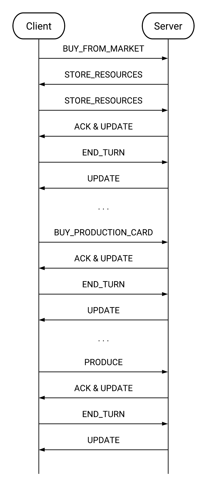

# Communication Protocol
## Group ID: AM13 - A.Y. 2020/21

This document's aim is to provide a clear overview of *Maestri del Rinascimento* project's communication protocol. Most relevant and crucial exchanges are going to be highlighted here. 
<br>

Each message that goes through the network is a `MesssageEnvelope` class object that has been serialized with JSON. So all of them follow the JSON format shown below:

```
{
	"messageID" : "TAG",
	"payload" : "{message content for the receiver}"
}
```
And the Java class:
```Java
public class MessageEnvelope{
	MessageID messageId;
	String payload;
}
```

The `messageID` gives information about the type of event that has arisen in the sender, the `payload` field adds content or useful information for the receiver in order for it to react correctly. The `payload` could be a simple String or one of the Message class object serializd with JSON as well if the `MessageId` has one associated to it ([see below](#message-classes-mapping-to-messageids)).
<br/>

Whether it's an event occurred whithin the Client or a Server's response, respective messages will be created. For more complex messages that has to be sent through the network, we use ad hoc Java classes to incapsulate all the information in an organized way as MessageEnvelope's payload.  
<br/>

Thanks to the `MessageEnvelope` we always know how to immediately deserialize a package coming from the network. Once we have extracted the Json Object into a `MessageEnvelope` Java object, we can deserialize also the payload into a "primitive" type (i.e. String, Integer) or into one of our `Message` Java object based on the messageID (the representative type of the event).
<br/>

We decided to use Json as means of serialization instead of Java serialization because it is universally manageable, allowing us the potential of rewrite the client app in other programming languages in the future. Furthermore is readable, easing the debug process for us.


# Table of Contents
- [Communication Protocol](#communication-protocol)
  * [Group ID: AM13 - A.Y. 2020/21](#group-id--am13---ay-2020-21)
- [Initialization](#initialization)
  * [1. Player registration](#1-player-registration)
    + [Case (A)](#case--a--)
    + [Case (B)](#case--b--)
  * [2. Game initiation](#2-game-initiation)
- [Mid-game messages](#mid-game-messages)
  * [3. Server to Client Messages](#3-server-to-client-messages)
    + [3.1 Client View Update](#3-1-client-view-update)
      - [Current player notification](#current-player-notification)
      - [Progression inside the _Faith Track_](#progression-inside-the--faith-track-)
      - [Purchase from Market](#purchase-from-market)
      - [Purchase of Production Cards](#purchase-of-production-cards)
      - [End game](#end-game)
    + [Requests for current player turn](#requests-for-current-player-turn)
      - [Production](#production)
      - [Resources placement](#resources-placement)
  * [4. Client to Server Messages](#4-client-to-server-messages)
    + [Production](#production-1)
    + [Buy from Market](#buy-from-market)
    + [Buy Production Cards](#buy-production-cards)
- [Message classes mapping to MessageIDs](#Message-classes-mapping-to-MessageIDs)

# Initialization
## 1. Player registration
The connection phase is executed upon the players' insertion of their IP address and port. They will contact the server on the default port **27001** (if no custom option is given) or through the port chosen upon Server configuration from cmd, that has the purpose of listening for new incoming players. 

The pair `ClientSocketConnection` and `RemoteView` forms the interface through which the server sees each player.

Once the connection is accepted, it submits the respective `ClientSocketConnection` (which implements `Runnable` interface) of that player to a Thread from a ThreadPool which will be in charge of serving the player throughout the game. This lets the Server keep listening for new connection requests without beign interrupted by players already registered. 
<br/>

Now the ClientConnetionSocket begins the RegistrationPhase by sending the Client some requests of which we report here the respective messageIds: `ASK_NICK`, `PLAYER_NUM` and `CONFIRM_REGISTRATION`. It expects that these requests will be replied with the data to indentify the player and the game type.

Once this is done, if the multiplayer option has been chosen, the player is put into a lobby waiting for other players whom would like to play with the same game size. The *waiting lobby* structure is a map (i.e. `Map<String, ClientConnection> threePlayerWait`) in which each entry is the the nickname and the ClientConnection of players waiting to find a group. We keep filling this map as play requests for the same size arrives, until the number of players in it equates the lobby capacity (for example, the `threePlayerWait` has a capacity of 3 people).
<br> 
Once it's filled, we clear that map allowing room for the creation of a new lobby of the same size if needed, and move the players to an another map since the game can be finally started. Following the previous example, the new map is a `Map<ClientConnection, List<ClientConnection>> threePlayerPlay` and it has one entry for each player currently in a game of size 3 and, as value, has a list of his/her opponents. This expedient has been thought as a way to allow the server to host multiple games at the same time. In fact, we  allow just one room at a time waiting for a game of size 3 to start as we wish to fill quickly the lobby, but multiple games of size 3 going on at the same time.

 
## 2. Game initiation


There are a few things to do upon game initiation:
* Each player needs to choose 2 out of 4 LeaderCards given randomly by the Server. The messages will look as such:
```
// Message: server -> client
{
	"messageID" : "CHOOSE_LEADER_CARDS",
	"payload" : {
		"leaderCards" : [3, 4, 6, 8]
	}
}

// Message: client -> server
{
	"messageID" : "CHOOSE_LEADER_CARDS",
	"payload" : {
		"leaderCardsToKeep" : "[4, 8]"
	}
}
```
Each card has a unique ID defined in the [JSON configuration files](https://github.com/Javinyx/ingswAM2021-Barone-Belotti-Braccini/tree/main/src/main/resources/json) used both by Server and Client to build each Java Object representing those cards. We use the corresponding IDs instead of the whole serialized card in order to keep the messages lightweight.

* Request players' preferred resources based on their turn order, with messages like the following: 
```
// Message: server -> client
{
	"messageID" : "CHOOSE_RESOURCE",
	"payload" : {
		"quantity": 2
	}
} 

// Message: client -> server
{
	"messageID" : "STORE_RESOURCES",
	"payload" : {
		{
			"resource": "SHIELD",
			"position": "SmallWarehouse"
		},
		{
			"resource": "COIN",
			"position": "MidWarehouse"
		}
	}
}

//If the player's requests cannot be processed because it's malformed
// Message: server -> client
{
	"messageID" : "BAD_STORAGE_REQUEST"
	"payload"   : {}
}
```
Every value and faithPoint assignment follows the ruleset in the table below:

| Player | Resources of your choosing | Faith Points |
|:------:|:--------------------------:|:------------:|
|   1st  |              0             |       0      |
|   2nd  |              1             |       0      |
|   3rd  |              1             |       1      |
|   4th  |              2             |       1      |


* Update each player's view with their initial position on the faith track based on their turn order, with messages like the following:
```
// Message: server -> client
{
	"messageID" : "PLAYER_POSITION",
	"payload" : {
		[
			"player" : 1,
			"boardCell" : 0
		],
		[
			"player" : 2,
			"boardCell" : 1
		]
	}
}
```

Before actually starting the game, as many [UPDATE](#update-message)  messages as players in game are sent to everyone in the party so that they can have an overall view of the starting situation. Then a `START_INITIAL_GAME` is sent to everyone.

## Mid-game messages



### Messages in broadcast
The following messages are sent to each player in the game, because everyone has to see the changes in the model caused by other players as well:

#### Update Message
```Java
public class UpdateMessage extends SimpleMessage{
	private final int playerId, playerPos, nextPlayerId;
    private final Resource[][] marketBoard;
    private final Resource extraMarble;
    private final List<Integer> availableProductionCards;

    private final List<BiElement<Integer,Integer>> productionCardsId;
    private final List<BiElement<Integer, Boolean>> leadersId;
    private final Map<BiElement<Resource, Storage>, Integer> addedResources, removedResources;
}
```
Usually this message is sent by the server at the end of each player's turn to all the players, but it's occasionally used even in registrationPhase to communicate the initial status. This class is one of the Messages class that will be serialized in JSON and the resulting string will be squished into the `payload` field of `MessageEnvelope`.
* `playerId` and `playerPos` are the id and current position of the player who has triggered this update message (at the end of the turn);
* `nextPlayerId` is the id of the player who has to play next;
* `marketBoard`, `extraMarble` and `availableProductionCards` are included since they're global information that concern every player. In fact, after a market action or a development card's purchase done by `playerId`, the market state or the cards still available have been through changes that the other must know, so their client status has to be updated as well since the model has changed;
* `productionCards` is a list of pairs of card ID bought and in which of the 3 stacks on the `playerId` board the card has been put;
* `leadersId` is a list of pairs of leaders ID and their activation status represeted through a boolean. This can be used to communicate how many leaders the `playerId` has, which are active and which not;
* `addedResources` and `removedResources` represents the modification that the player storage has been through during his/her turn. So everyone can update their local storage status of `playerId` accordingly by adding those resources specified in `addedresources` and removing those in `removedResources`. The map contains a pair of Resource and Storage type as key and the quantity.

So this message incapsulate the player's id that has to play the next turn as well as the modifications and progression happened last turn.


#### Progression onto the _Faith Track_
```
{
	"messageID" : “PLAYER_POSITION",
	"payload" : {
		[
			"player" : 1,
			"boardCell" : 17
		],
		...
	}
}
```
* `player` specifies which player has gone forward onto the _Faith Track_. The id refers to the player's turn. This message can be caused by the current player's production phase 
   if some faith points are generated, or from someone else discarding resources;
* `boardCell` is the updated position on the player's board.


#### End game
```
{
	"messageID" : "END_GAME",
	"payload" : {
		"winner" : 1
	}
}
```
In a singleplayer game, if Lorenzo wins, then `"winner" : 0`.

### 1-to-1 message exchanges
#### Leader card activation
```
{
  "messageID" : "ACTIVATE_LEADER",
  "payload" : {
       "leaderCardId" : 15
  }
}
```
If the card is not activable for that player, the server will respond with an error, otherwise with and `ACK`.

#### Production
```
{
	"messageID" : "PRODUCE",
	"payload" : {
		"productionCards" : [id1, id2...],
		"resourcesWallet" : {...},
		"leaderCards" : [5, 7],
		"leadersOutput" : [SHIELD, COIN],
		"basicProduction" : true,
		"outputBasic" : "COIN"
	}
}
```
* `productionCards` contains the cards that the user wants to use for production.
* `resourcesWallet` is a class that wrap the information about how the players want to spend their resources for buying the card
* `boostAbilityCards` contains the leader cards of type BoostAbility that will be used during production.
* `outputLeader` contains all the BoostAbility leaderCards outputs of player's choice as a list of resources.
* `basicProduction` indicates if the user would like to use the standard production given by the game board.
* `outputBasic` indicates the type of Resource the user wants to receive from basicProduction.

The respective Java class is:
```Java
public class ProduceMessage extends SimpleMessage {
    private final List<ConcreteProductionCard> productionCards;
    private final ResourcesWallet resourcesWallet;
    private final List<BoostAbility> leaderCards;
    private final List<Resource> leaderOutputs;
    private final boolean basicProduction;
    private final Resource basicOutput;
}
```

#### Buy from Market
```
{
	"messageID" : "BUY_FROM_MARKET",
	"payload" : {
        "info" : 
		{
            "dimension" : "row",
            "index" : 2
			"marbleUsage" : [
            {
                "marbleLeader" : id,
                "quantityToConvert" : 1
            },
            {
                "marbleLeader" : id,
                "quantityToConvert" : 2
            }
		]
	}
}
```
* `dimension` and `index` are the coordinates identifying the resources chosen on the Market Board
* `marbleUsage` contains the information regarding active MarbleAbility leader cards which the player would like to use onto the specified quantity of blank marbles collected from the market.

#### Resources placement
The server notifies the players that they have to place the resources that they previously acquired, for example, from the market.

The client responds with this kind of message:
```
{
	"messageID" : "STORE_RESOURCES",
	"payload" : {
		"placements" : [
			{
				"resource" : STONE,
				"storage" : WAREHOUSE_SMALL
			},
			{
				"resource" : SHIELD,
				"storage" : WAREHOUSE_MID
			},
			...
		],
		"turnID" : 1
	}
}
```
The payload in the Client message version is a `StoreResourceMessage` Java object instead of a simple list of resources as sent by the server.

#### Buy Production Cards
```
{
	"messageID" : "BUY_PRODUCTION_CARD",
	"payload" : {
		"prodCardId" : 37,
		"stack" : 2,
		"leaderId" : [5, 6],
		"resourcesWallet" : {...} 
	}
}
```
* `prodCardId` contains the card that the user wants to buy
* `stack` is the index of where the card should be placed on the Player's Board once it has been bought
* `resourcesWallet` is a class that wrap the information about how the players want to spend their resources for buying the card
* `leaderId` indicates the leader cards of Discount type that the player wants to use during this phase.

## Message classes mapping to MessageIDs
Most important messages are reported below. Mind that some error messages are not included in the list since they don't have any `Payload` associeted to them and are self-explanatory.

Furthermore, some messageIDs are used both directions (from Client to Server and vice versa) for questions and answers, so they have slight differences in the paylod.

| MessageID | Payload | Meaning |
|:-----------:|:---------:|:-------|
|ASK_NICK|String|
|PLAYER_NUM | Integer| The size the player wants the game to be|
|CONFIRM_REGISTRATION|| Player is now registered correctly in the server|
|UPDATE| UpdateMessage| Used to show the status of a player or just the changes between turns|
|CHOOSE_LEADER_CARD| List\<Integer\>| List of 4 leaders to choose and the 2 in response
|ACK | Boolean | Player's request has been fullfilled by the server. `True` if the action is a major one (that can be done just once per turn), `False` otherwise.|
|STORE_RESOURCES | List\<Resource> or StoreResourcesMessage ||
|BUY_PRODUCTION_CARD| BuyProductionMessage | |
|PRODUCE| ProduceMessage | |
